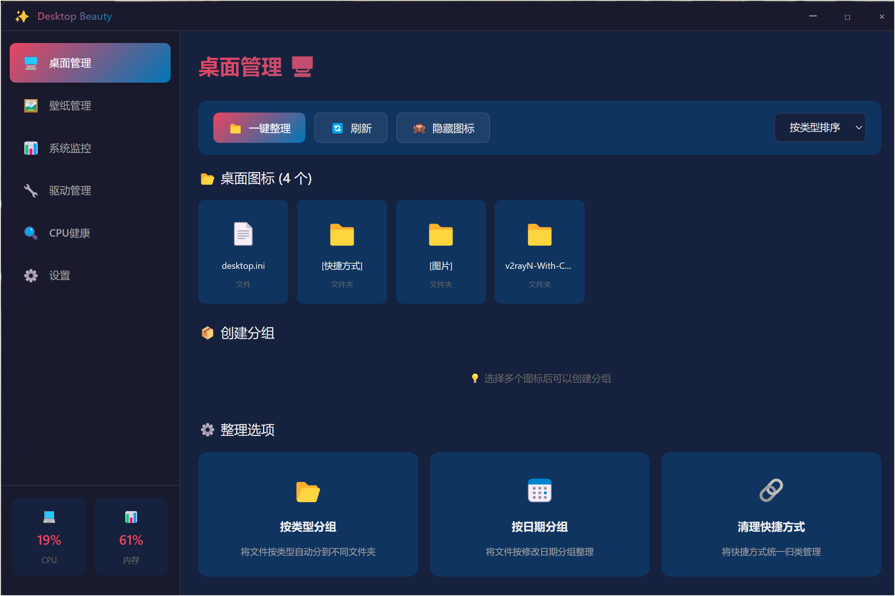
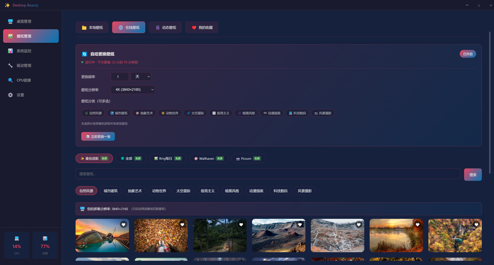
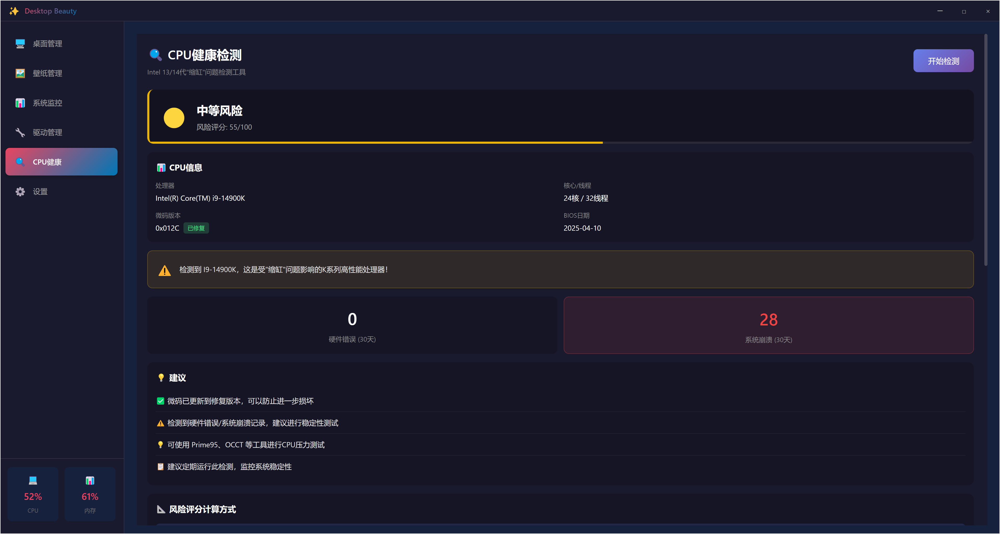
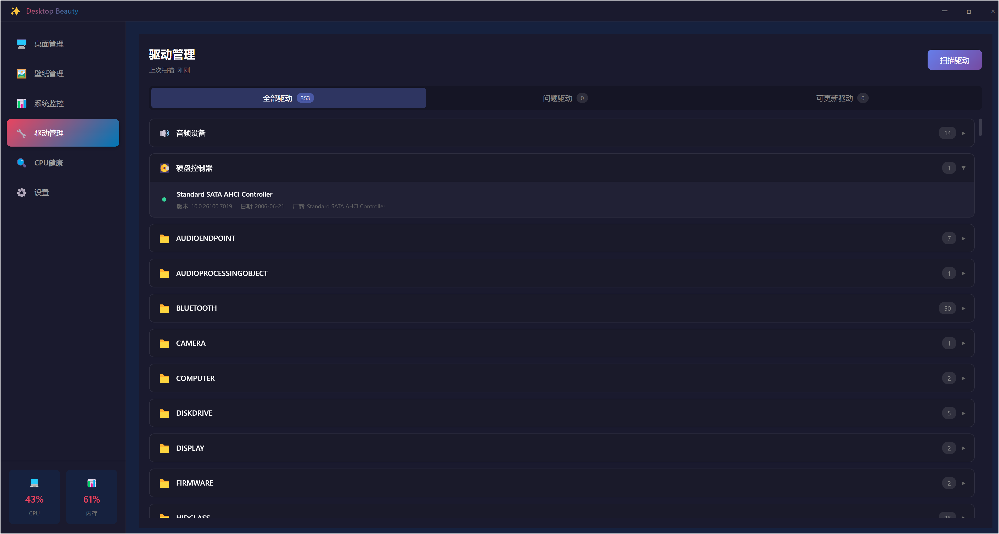
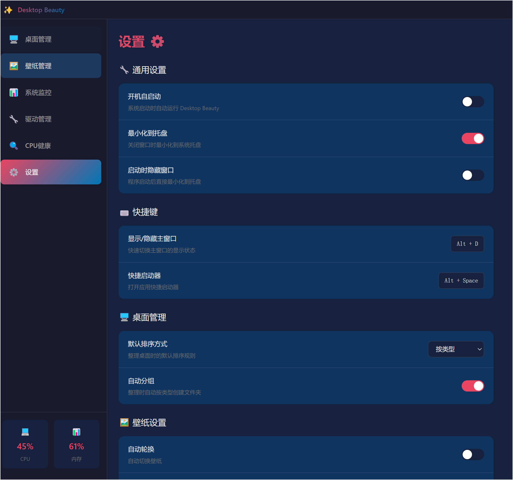

# 🎨 Desktop Beauty (桌面美化工具)

> 一个基于 Electron + Vue 3 构建的现代化桌面美化与管理工具，致力于提供优雅、高效的 Windows 桌面体验。


## ✨ 主要功能

### 1. 🖼️ 极致壁纸体验
- **在线壁纸库**：集成 Wallhaven 等高质量图源，支持按分类（动漫、风景、简约等）浏览。
- **动态壁纸**：支持视频壁纸，让桌面动起来。
- **自动轮播**：自定义轮播间隔，每天都有新感觉。

### 2. 📊 系统状态监控
- **实时监控**：在桌面直观展示 CPU、内存、网络上传/下载速度。
- **悬浮窗模式**：支持迷你悬浮窗，随时掌握系统负载。

### 3. 🛡️ CPU 健康检测
- **0x12B 微码检测**：专为 Intel 13/14 代处理器设计，检测是否已更新至最新的微码补丁，预防缩缸风险。
- **电压监控**：实时监控 CPU 电压状态。

### 4. 🚀 效率工具
- **快捷启动器**：`Alt + Space` 呼出极速启动器，快速打开应用或文件。
- **桌面整理**：一键整理桌面图标，保持桌面整洁。
- **驱动管理**：简单的驱动状态查看与管理。

### 5. ☁️ 智能服务
- **自动更新**：后台静默下载更新，重启即用最新版本。
- **数据仪表盘**：内置遥测系统，开发者可实时查看应用活跃度（已脱敏）。

## 📸 界面预览

### 🏠 桌面管理 & 壁纸中心



### 📊 系统监控 & CPU 健康



### 🛡️ 驱动管理 & 设置



## 🛠️ 技术栈

- **核心框架**: [Electron](https://www.electronjs.org/)
- **前端框架**: [Vue 3](https://vuejs.org/) + [TypeScript](https://www.typescriptlang.org/)
- **构建工具**: [Vite](https://vitejs.dev/)
- **状态管理**: [Pinia](https://pinia.vuejs.org/)
- **UI 样式**: SCSS + 自定义组件库
- **后端服务**: Node.js + Express (用于遥测和更新服务)

## 📦 安装与使用

### 下载安装
前往 [Releases](../../releases) 页面下载最新版本的安装包 (`.exe`)。

### 开发环境运行

```bash
# 1. 克隆项目
git clone https://github.com/pigWolfy/desktop-beauty.git

# 2. 安装依赖
npm install

# 3. 启动开发模式
npm run electron:dev
```

### 构建发布

```bash
# 构建 Windows 安装包
npm run electron:build
```

构建产物将位于 `release` 目录下。

## 🤝 贡献

欢迎提交 Issue 和 Pull Request！

1. Fork 本仓库
2. 新建 Feat_xxx 分支
3. 提交代码
4. 新建 Pull Request

## 📄 开源协议

本项目采用 [MIT](./LICENSE) 协议开源。
